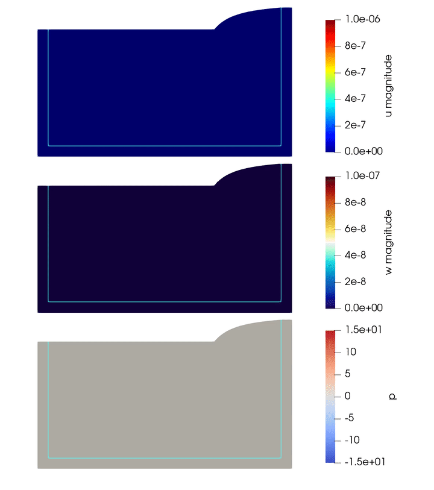
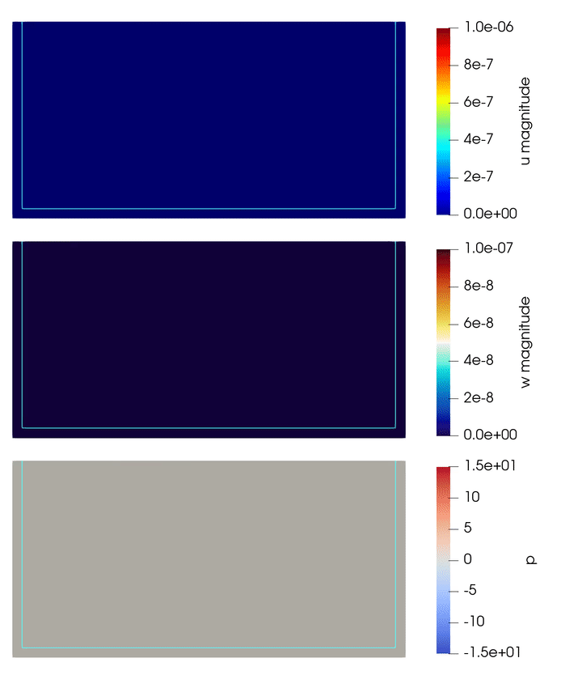

# Hybrid PML formulation for poroelastodynamics
 

This repository contains all the source code to run wave propagation experiments in poroelastic media using Perfectly Matched Layers (PML) as absorbing boundary conditions. The implementation of the PML method was done in a "hybrid" way, meaning that we are solving two PDEs (poroelasticity + poroelasticity-with-PML) in two disjoint regions coupled with Lagrange multipliers.

The resulting strong problem was solved using the finite elements method through the libraries [FEniCS](https://fenicsproject.org/) and [multiphenics](https://github.com/multiphenics/multiphenics). The finite elements meshes were generated using [gmsh](https://www.gmsh.info/) and [meshio](https://github.com/nschloe/meshio).

For more details about the PML formulation, please refer to:

Mella H., Sáez E., and Mura J. 2023. A hybrid PML formulation for the 2D three-field dynamic Biot's equations. Comput. Meth. Appl. Mech. Eng. In Press. [https://doi.org/10.1016/j.cma.2023.116386](https://doi.org/10.1016/j.cma.2023.116386).


## FEniCS installation
The easiest way of running FEniCS on any OS is to use [Docker Desktop](https://hub.docker.com/?overlay=onboarding) (the following instructions were taken from docker part of the [fenicsproject page](https://bitbucket.org/fenics-project/docker/src/master/)). To install Docker for your platform (Windows, macOS, Linux, cloud platforms, etc.), follow the instructions at [docker.com](https://docs.docker.com/engine/getstarted/step_one/).

Once you have Docker installed, you can run any of the images below using the following command:

    docker run -ti quay.io/fenicsproject/<image-name>:latest

To start with you probably want to try the `stable:current` image which includes a full stable version of FEniCS with PETSc, SLEPc, petsc4py and slepc4py already compiled. This image has been checked by the FEniCS Project team:

    docker run -ti quay.io/fenicsproject/stable:current

If you want to share your current working directory into the container use the following command:

    docker run -ti -v $(pwd):/home/fenics/shared quay.io/fenicsproject/<image-name>:latest
    
If you want to be able to view the plots in your web browser, use the following command:

    docker run -ti -p 127.0.0.1:8000:8000 -v $(pwd):/home/fenics/shared quay.io/fenicsproject/<image-name>:latest

### Images

FEniCS currently offer several end-user images. A full description of the images can be found at https://fenics-containers.readthedocs.org/.

**Important:** The experiments provided in this repository where tested using the `dev:latest` fenics image. You need to share the path to the codes contained in this repository as the working directory of the fenics container to be able to run the experiments. All the below instructions assume that the source code are visible from the fenics container.

## Multiphenics installation
Inside the docker container, run the following lines to install [multiphenics](https://github.com/multiphenics/multiphenics):

    git clone git@github.com:multiphenics/multiphenics.git &&
    cd multiphenics-master/ &&
    python3 setup.py install --user

## Installing libraries for mesh generation
In linux, gmsh can be directly installed using
    
    sudo apt-get install gmsh

or can be compiled from source following the instructions on the [gmsh website](https://www.gmsh.info/).

Then, meshio can be installed from the python3 package manager using the following command:

    sudo pip3 install meshio h5py

Both gmsh and meshio can be installed outside the docker container.

## Handling parameters
Some simulation parameters are handled using YAML. Therefore, you need to install pyyaml (inside the docker container) before running the experiments:

    sudo pip3 install pyyaml

## Running the codes
### Mesh generation
The meshes are generate using the scripts given in ```PML_base/gmsh_geometries/``` jointly with gmsh and meshio. To generate the meshes please run:

    python3 mesh_foo.py

The meshes are stored in ```mesh/```. Before running the simulations, mesh restrictions must be generated using multiphenics with the following command:

    python3 generate_restrictions.py

### Running the experiments
Once everything is installed, just go to any `Experiment_i/` folder and run
    
    python3 poroelastodynamics_foo.py    

or

    mpirun -n nr_processess python3 foo.py    

to run in parallel. By default, results are stored in the ```output/``` folder in HDF5 format (suitable for postprocessing) and XDMF (suitable for visualization). If runtime visualization is needed, the option ```PVD=True``` (the default value is ```False```) can be chosen when defining any of the ```FooProblem``` objects (just for this format, 1 frame every 20 timesteps is stored. This can be changed using the ```save_every_n``` option).

Executing the script ```energy_foo.py```, the poroelastic energy inside the regular domain and the traces at the locations defined in ```PARAMETERS.yaml``` can be obtained (this script only runs in serial). To obtain the same figures of the article, you have to run the ```plot_energies.m``` and ```plot_seismograms.m``` Matlab scripts.